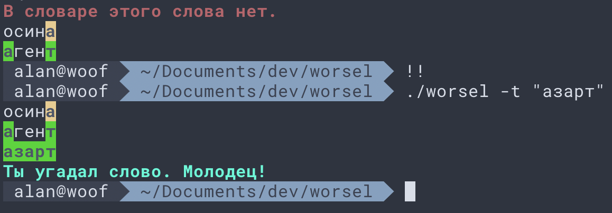

# worsel

A Russian terminal-based Wordle equivalent. Play Russian word puzzles on the command line.

## Installation

I'm sorry, I don't have time to package this up all neatly for easy installation. But if you are someone who can play Wordle on the command line, I suspect that you don't need any hand-holding. Just download the files and install any modules that you may not have.

## Game play

To start a new game:

`./worsel -n`

To provide a suggested word:

`./worsel -t "осина"`

That's it. Enjoy!

`